<!-- ========================= HEADER ========================= -->
<div align="center">


<a href="https://git.io/typing-svg">
  
</a>

<p>
  
  
  
</p>

</div>


## 🧑‍💻 About Me

<div align="center">
  
</div>

<details>
<summary><b>📜 Prefer it as code? Click to expand</b></summary>

```typescript
const dhrishit: Developer = {
  name:       "Dhrishit Seal",
  location:   "Dublin, Ireland 🇮🇪",
  education:  [
    { degree: "MSc Computer Science (Negotiated Learning)", school: "University College Dublin", period: "2026 – 2027" },
    { degree: "B.Tech CSE (Health Informatics)", school: "VIT Bhopal", period: "2022 – 2026", cgpa: 8.25 },
  ],
  interests:  ["Microservices", "Backend Systems", "DevOps", "AI Agents", "ML on Medical Imaging"],
  experience: ["SDE Intern @ Nomura Services India", "SDE Intern @ Reliance Industries"],
  published:  "IEEE Xplore — ViT vs CNN on OCT Scans",
  openTo:     { roles: ["SWE Intern", "SDE Intern"], from: "May 2027", mode: ["Remote", "On-site"] },
};
```

</details>


## 💼 Experience


**🏦 SDE Intern · Nomura Services India Pvt. Ltd.** · Mumbai &nbsp;`Aug 2025 – Jan 2026` &nbsp;[](https://drive.google.com/file/d/1vpBrfY5c-H7POurO1ff2_bK8Hi77itBU/view?usp=sharing)
- Built a **Spring Boot** microservice (Apache POI, Java Streams) that fully automates an end-to-end Excel → DB financial data pipeline, replacing a 100% manual workflow; shipped via **Jenkins CI/CD** to the UAT batch server with **Autosys** scheduling and email integration
- Led backend development of the internal Budgeting application: RESTful API design, migrating a static menu to a DB-driven dynamic menu, and **RBAC** across UAT & DEV, covered by **JUnit & Mockito** suites
- Worked in target-driven Agile sprints, contributing to sprint planning and cutting issue resolution time

**🏭 SDE Intern · Reliance Industries Limited** · Navi Mumbai &nbsp;`Oct 2024 – Jan 2025` &nbsp;[](https://drive.google.com/file/d/1vloW7jAe-W6EUpPGPiOAFrepfadoj_2z/view?usp=sharing)
- Preprocessed and reconstructed controller output (OP) and process variable (PV) data to extract slow features using the **Dynamic Slow Feature Analysis (DSFA)** algorithm, improving signal precision and visualisation fidelity
- Validated noise robustness through numerical simulations on 18 months of process-control logs (**~390K samples** at 2-min intervals)
- Wrote a reusable Python script that runs daily (24h) on Jamnagar plant data streams, using DSFA + the **Hurst exponent** to detect and visualise valve stiction


## 🚀 Featured Projects

<div align="center">

<a href="https://github.com/Dhrishit04/Tournament-Tracker"></a>
<a href="https://github.com/Dhrishit04/Tournament_Tracker_Pro"></a>
<a href="https://github.com/Dhrishit04/Tesseract"></a>
<a href="https://github.com/Dhrishit04/HealthSim"></a>
<a href="https://github.com/Dhrishit04/MyFER"></a>
<a href="https://github.com/Dhrishit04/My_Medisage"></a>
<a href="https://github.com/Dhrishit04/taskflow"></a>

</div>

<details open>
<summary><b>🏆 Tournament Tracker / Tournament Tracker Pro</b> — 200+ concurrent users, zero downtime</summary>

<br/>

> Full-stack tournament management platform deployed live with 200+ concurrent users and zero downtime.

- **Real-time sync** via Firestore snapshot listeners for live match updates & global broadcasts
- **Granular RBAC** with Firebase Auth + Firestore security rules across 3 admin tiers with full audit logging
- **Bulk ingestion** via Excel pipeline, season lifecycle management, responsive admin command center
- **Stack:** `Next.js` `React` `TypeScript` `Firestore` `Firebase Auth` `Tailwind CSS` `Framer Motion`

</details>

<details open>
<summary><b>🧠 Tesseract</b> — cross-platform desktop AI agent</summary>

<br/>

- Desktop AI agent built with **Tauri, React and Rust**, with a native GUI that drives Python-based AI workflows for voice interaction, model-driven reasoning and task automation
- Modular **Python sidecar** with API-key-based LLM integration (OpenRouter), local speech processing, and automation tools for browser, desktop and document operations on Windows and macOS
- Agentic execution by bridging the frontend, native shell and Python services through **IPC and tool orchestration**
- **Stack:** `Tauri` `Rust` `React` `TypeScript` `Python` `OpenRouter`

</details>

<details>
<summary><b>🏥 HealthSim</b> — software-based IoT health monitoring with dynamic risk assessment</summary>

<br/>

- Synthetic vital stream generation with `NumPy` / `Pandas`, ingested via a `Flask` REST API into `SQLite`
- `scikit-learn` driven risk analytics; visualised via `Recharts` / `Victory` on a React frontend
- **Stack:** `Python` `Flask` `React` `SQLite` `scikit-learn` `NumPy` `Pandas`

</details>

<details>
<summary><b>😶 MyFER</b> — real-time facial expression recognition</summary>

<br/>

- Deep-learning pipeline for live emotion detection from a webcam feed
- **Stack:** `Python` `OpenCV` `TensorFlow / Keras` `React`

</details>

<details>
<summary><b>💊 My Medisage</b> — patient & prescription workflow platform</summary>

<br/>

- **Stack:** `React` `Node.js` `Express` `MongoDB`

</details>

<details>
<summary><b>✅ TaskFlow</b> — task & project management for developer workflows</summary>

<br/>

- **Stack:** `React` `TypeScript` `Node.js` `PostgreSQL`

</details>

<details>
<summary><b>💸 Expense Tracker</b> — categorised spending analytics & trends</summary>

<br/>

- [Repository](https://github.com/Dhrishit04/Expense-Tracker) · **Stack:** `React` `Node.js` `Express` `MongoDB`

</details>


## 🧰 Tech Stack

<div align="center">


<br/>

<b>Languages</b><br/>


<b>Backend</b><br/>


<b>Frontend & Desktop</b><br/>


<b>Databases</b><br/>


<b>Data & ML</b><br/>


<b>DevOps & Tools</b><br/>


<b>Testing & Practices</b><br/>


</div>

## 📡 Currently Learning

<div align="center">


</div>


## 📊 GitHub Analytics

<div align="center">


<br/><br/>


<br/><br/>

<!-- 3D contribution skyline (generated by .github/workflows/snake.yml) -->
<picture>
  <source media="(prefers-color-scheme: dark)" srcset="https://raw.githubusercontent.com/Dhrishit04/Dhrishit04/output/profile-night-rainbow.svg" />
  <source media="(prefers-color-scheme: light)" srcset="https://raw.githubusercontent.com/Dhrishit04/Dhrishit04/output/profile-gitblock.svg" />
  
</picture>

<br/><br/>

<!-- Contribution snake (generated by .github/workflows/snake.yml) -->
<picture>
  <source media="(prefers-color-scheme: dark)" srcset="https://raw.githubusercontent.com/Dhrishit04/Dhrishit04/output/github-contribution-grid-snake-dark.svg" />
  <source media="(prefers-color-scheme: light)" srcset="https://raw.githubusercontent.com/Dhrishit04/Dhrishit04/output/github-contribution-grid-snake.svg" />
  
</picture>

</div>


## 📄 Publications & Certifications

- 📄 **IEEE Xplore** — [*A Comparative Study between Vision Transformers and CNN Models on Optical Computed Tomography Scans*](https://ieeexplore.ieee.org/document/11135526)
  — benchmarked ViT vs. CNN architectures for retinal disease detection (CNV, DME, Drusen) on OCT datasets
- 🎓 **UI/UX Fundamentals** — IIT Bombay
- 🎓 **HTML, CSS & JavaScript for Web Developers** — Johns Hopkins University
- 🎓 **Introduction to Relational Database and SQL** — Coursera


## 📬 Connect

<div align="center">

**🎯 Looking for SWE / SDE internships from May 2027, remote or on-site. Let's talk!**

<a href="https://www.linkedin.com/in/dhrishit-seal-b5a959251"></a>
<a href="mailto:sealdhrishit@gmail.com"></a>
<a href="https://github.com/Dhrishit04"></a>

<br/><br/>


</div>
